Catalogue des objets
====================

1. [Dangers](#dangers)
    * [Dangers](#dangers-1)
    * [Risques](#risques)
2. [Accès](#acc%C3%A8s)
    * [Accès](#acc%C3%A8s-1)
    * [Signalisation](#signalisation)
    * [Emplacements](#emplacements)
3. [Objectifs](#objectifs)
    * [Détections](#d%C3%A9tections)
    * [Clés](#cl%C3%A9s)
    * [Codes](#codes)
    * [Situation](#situation)
    * [Dossiers d'intervention](#dossiers-dintervention)
    * [Bâtiments](#b%C3%A2timents)
4. [Moyens](#moyens)
    * [Bornes hydrantes](#bornes-hydrantes)
    * [Puits réservoirs](#puits-r%C3%A9servoirs)
    * [Tuyaux](#tuyaux)
    * [Barrages](#barrages)
5. [Organisation](#organisation)
    * [Sites](#sites)
    * [Secteurs d'intervention](#secteurs-dintervention)
    * [Secteurs organisationnels](#secteurs-organisationnels)

Dangers
-------

### Dangers

Sources de danger

| Type           | Symbole                                                    | Description                            | Exemple                                                                      |
| -------------- | ---------------------------------------------------------- | -------------------------------------- | ---------------------------------------------------------------------------- |
| **Feu**        | 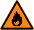               | Danger particulier d’incendie          | Station-service, scierie                                                     |
| **Gaz**        | 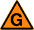               | Gaz inflammable, risque d’explosion    | Citerne de gaz                                                               |
| **Electrique** | 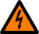 | Source de danger d’origine électrique  | Armoire électrique, panneaux solaires photovoltaïques                        |
| **Toxique**    | 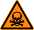       | Produits toxiques                      | Stock de produits                                                            |
| **Radioactif** | 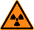 | Sources radioactives                   | Laboratoire                                                                  |
| **Infectieux** | 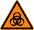 | Substances infectieuses                | Laboratoire                                                                  |
| **Pollution**  | 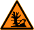   | Produits pouvant causer des pollutions | Stock de produits                                                            |
| **Autre**      | 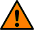           | Autres sources de danger               | Installation d'enfumage en cas d'effraction, appareil IRM, animaux dangereux |

### Risques

Eléments à risque

| Type                   | Symbole                                                      | Description                                                                  | Exemple                    |
| ---------------------- | ------------------------------------------------------------ | ---------------------------------------------------------------------------- | -------------------------- |
| **EMS**                |                          | Maison de retraite                                                           |                            |
| **Hôpital**            |                          | Hôpital, clinique, centre de convalescence, foyer d’handicapés               |                            |
| **Ecole**              |                          | Ecole, garderie                                                              |                            |
| **Parking souterrain** |                          | Parking souterrain collectif                                                 |                            |
| **Bien culturel**      |                          | Biens mobiliers ou immobiliers à préserver en priorité                       | Archives communales, musée |
| **Pisciculture**       |                          | Site présentant un risque accru en cas de pollution de rivière               |                            |
| **Bâtiment isolé**     | 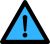 | Bâtiment ne disposant pas d’alimentation en eau suffisante en cas d’incendie | Hameau, ferme isolée       |
| **Autre**              |                          | Autre risque                                                                 |                            |

Accès
-----

### Accès

Accès et cheminements

| Type               | Symbole | Description                                     | Exemple               |
| -------------------| ------- | ----------------------------------------------- | --------------------- |
| **Véhicule**       | ...     | Accès pour les véhicules d'intervention         |                       |
| **Reconnaissance** | ...     | Cheminement pour la reconnaissance à pieds      | Accès cour intérieure |
| **Echelle**        | ...     | Facades accessibles avec une échelle automobile |                       |
| **Entrée**         | ...     | Entrée de bâtiment                              |                       |
| **Motopompe**      | ...     | Cheminement pour placer une motopompe           |                       |
| **Barrage**        | ...     | Cheminement pour mettre un barrage à l'eau      |                       |

### Signalisation

Signalisation pour accès véhicules

| Type                     | Symbole                                                                                      | Description                          | Exemple               |
| ------------------------ | -------------------------------------------------------------------------------------------- | ------------------------------------ | --------------------- |
| **Sens interdit**        |                | Sens interdit                        |                       |
| **Travaux**              | 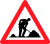                           | Travaux                              |                       |
| **Danger**               | 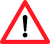                             | Danger                               |                       |
| **Interdiction camions** | 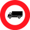 | Interdiction camions                 |                       |
| **Hauteur limitée**      |            | Hauteur limitée (avec valeur en [m]) | Accès cour intérieure |
| **Largeur limitée**      |            | Largeur limitée (avec valeur en [m]) | Pont                  |
| **Poids limité**         |                  | Poids limité (avec valeur en [t])    | Pont                  |
| **Tout droit**           |                      | Tout droit                           |                       |
| **Déviation**            |                        | Déviation                            |                       |

### Emplacements

Emplacements pour moyens d'intervention

| Type            | Symbole | Description | Exemple                                          |
| --------------- | ------- | ----------- | ------------------------------------------------ |
| **Motopompe**   | ...     | Motopompe   | Pour du pompage dans rivière                     |
| **Tonne pompe** | ...     | Tonne pompe | Pour un véhicule relais                          |
| **Echelle**     | ...     | Echelle     | En fonction d'arbres, accès à plusieurs façacdes |

Objectifs
---------

### Détections

Alarmes avec télétransmission et dispositifs d'extinction

| Type          | Symbole                                    | Description                                  | Exemple |
| ------------- | ------------------------------------------ | -------------------------------------------- | ------- |
| **Détection** |  | Alarme incendie, détection de gaz, sprinkler |         |

### Clés

Clés d'accès

| Type     | Symbole                                  | Description              | Exemple |
| -------- | ---------------------------------------- | ------------------------ | ------- |
| **Clé**  |            | Accès verrouillé par clé |         |
| **Tube** |  | Tube à clé               |         |
| ???      |                                          |                          |         |
| ???      |                                          |                          |         |
| ???      |                                          |                          |         |

### Codes

Digicodes

| Type     | Symbole                          | Description                   | Exemple |
| -------- | -------------------------------- | ----------------------------- | ------- |
| **Code** |  | Accès verrouillé par digicode |         |

### Situation

Eléments de situation

| Type          | Symbole | Description | Exemple |
| ------------- | ------- | ----------- | ------- |
| **Ascenseur** | ...     | Ascenseur   |         |
| ???           |         |             |         |
| ???           |         |             |         |
| ???           |         |             |         |

### Dossiers d'intervention

Dossiers d'intervention

| Type                     | Symbole | Description            | Exemple |
| ------------------------ | ------- | ---------------------- | ------- |
| **Dossier intervention** | ...     | Dossier d'intervention |         |

### Bâtiments

Bâtiments avec objet SDIS

| Type         | Symbole | Description              | Exemple                                                                                            |
| ------------ | ------- | ------------------------ | -------------------------------------------------------------------------------------------------- |
| **Bâtiment** | ...     | Bâtiment avec objet SDIS | Bâtiment accessible avec clé, bâtiment avec source de danger, bâtiment avec dossier d'intervention |

Moyens
------

### Bornes hydrantes

Bornes hydrantes

| Type            | Symbole | Description                | Exemple |
| ----------------| ------- | -------------------------- | ------- |
| **Hors-sol**    | ...     | Borne hydrante             |         |
| **Souterraine** | ...     | Borne hydrante souterraine |         |

### Puits réservoirs

Puits et réservoirs

| Type                   | Symbole                                                      | Description                                                  | Exemple |
| ---------------------- | ------------------------------------------------------------ | ------------------------------------------------------------ | ------- |
| **Puit**               | ...                                                          | Puit avec réserve d’eau en cas d’incendie                    |         |
| **Réservoir**          | ...                                                          | Réservoir                                                    |         |
| **Commande réservoir** |  | Interrupteur de commande à distance pour la réserve incendie |         |

### Tuyaux

Emplacements pour tuyaux

| Type      | Symbole | Description             | Exemple                                  |
| --------- | ------- | ----------------------- | ---------------------------------------- |
| **Tuyau** | ...     | Emplacement pour tuyaux | Depuis motopompe, entre véhicules relais |

### Barrages

Barrages anti pollution

| Type        | Symbole | Description                        | Exemple |
| ----------- | ------- | ---------------------------------- | ------- |
| **Rivière** | ...     | Barrage anti pollution sur rivière |         |
| **Lac**     | ...     | Barrage anti pollution sur lac     |         |

Organisation
------------

### Sites

Casernes et locaux

| Type    | Symbole | Description                     | Exemple |
| ------- | ------- | ------------------------------- | ------- |
| **DPS** | ...     | Détachement de premiers secours |         |
| **DAP** | ...     | Détachement d'appui             |         |

### Secteurs d'intervention

Secteurs d'intervention

| Type                 | Symbole | Description                  | Exemple |
| ---------------------| ------- | ---------------------------- | ------- |
| **Feu**              | ...     | Feu                          |         |
| **Désincarcération** | ...     | Désincarcération (pionnier)  |         |
| **DCH**              | ...     | Défense contre hydrocarbures |         |

### Secteurs organisationnels

Secteurs organisationnels

| Type     | Symbole | Description | Exemple |
| -------- | ------- | ----------- | ------- |
| ???      |         |             |         |
| ???      |         |             |         |
| ???      |         |             |         |
