# Catalogue des objets

1. [Urgences](#urgences)
    * [Accès immeubles](#acc%C3%A8s-immeubles)
2. [Objectifs](#objectifs)
    * [Détections](#d%C3%A9tections)
    * [Clés](#cl%C3%A9s)
    * [Situation](#situation)
    * [Dossiers d'intervention](#dossiers-dintervention)
3. [Accès](#acc%C3%A8s)
    * [Accès](#acc%C3%A8s-1)
    * [Signalisation](#signalisation)
    * [Emplacements](#emplacements)
4. [Dangers](#dangers)
    * [Dangers](#dangers-1)
    * [Risques](#risques)
    * [Zones de danger](#zones-de-danger)
5. [Moyens](#moyens)
    * [Bornes hydrantes](#bornes-hydrantes)
    * [Prises d'arrosage SANE](#prises-darrosage-sane)
    * [Réserves d'eau](#r%C3%A9serves-deau)
    * [Transport d'eau](#transport-deau)
    * [Barrages](#barrages)
6. [Bâtiments](#b%C3%A2timents)
    * [Bâtiments](#b%C3%A2timents-1)
7. [Organisation](#organisation)
    * [Personnel d'intervention](#personnel-dintervention)
    * [Secteurs d'intervention](#secteurs-dintervention)
    * [Sites](#sites)
    * [Secteurs organisationnels](#secteurs-organisationnels)

## Urgences

### Accès immeubles

Accès immeubles

| Type                | Symbole                                                              | Description                                                                                        | Exemple |
| ------------------- | -------------------------------------------------------------------- | -------------------------------------------------------------------------------------------------- | ------- |
| **Accès immeubles** |                | Accès verrouillé par digicode, à défaut numéro de téléphone du concierge ou service d'intervention |         |

## Objectifs

### Détections

Alarmes avec télétransmission et dispositifs d'extinction

| Type          | Symbole                                                | Description                                  | Exemple |
| ------------- | ------------------------------------------------------ | -------------------------------------------- | ------- |
| **Détection** |  | Alarme incendie, détection de gaz, sprinkler |         |

### Clés

Clés d'accès

| Type     | Symbole                                              | Description              | Exemple |
| -------- | ---------------------------------------------------- | ------------------------ | ------- |
| **Clé**  |            | Accès verrouillé par clé |         |
| **Tube** |  | Tube à clé               |         |

### Situation

Eléments de situation

| Type          | Symbole                                        | Description | Exemple |
| ------------- | ---------------------------------------------- | ----------- | ------- |
| **Ascenseur** |      | Ascenseur   |         |

### Dossiers d'intervention

Dossiers d'intervention

| Type                     | Symbole                                                                      | Description            | Exemple |
| ------------------------ | ---------------------------------------------------------------------------- | ---------------------- | ------- |
| **Dossier intervention** |  | Dossier d'intervention |         |

## Accès

### Signalisation

Signalisation pour accès véhicules

| Type                     | Symbole                                                                                                    | Description                          | Exemple               |
| ------------------------ | ---------------------------------------------------------------------------------------------------------- | ------------------------------------ | --------------------- |
| **Sens interdit**        |                | Sens interdit                        |                       |
| **Travaux**              | 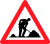                           | Travaux                              |                       |
| **Danger**               | 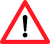                             | Danger                               |                       |
| **Interdiction camions** | 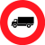 | Interdiction camions                 |                       |
| **Hauteur limitée**      |            | Hauteur limitée (avec valeur en [m]) | Accès cour intérieure |
| **Largeur limitée**      |            | Largeur limitée (avec valeur en [m]) | Pont                  |
| **Poids limité**         |                  | Poids limité (avec valeur en [t])    | Pont                  |
| **Tout droit**           |                      | Tout droit                           |                       |
| **Déviation**            |                        | Déviation                            |                       |

### Accès

Accès et cheminements

| Type                        | Symbole                                                                            | Description                                     | Exemple               |
| ----------------------------| ---------------------------------------------------------------------------------- | ----------------------------------------------- | --------------------- |
| **Véhicule**                |                                | Accès pour les véhicules d'intervention         |                       |
| **Reconnaissance**          |                    | Cheminement pour la reconnaissance à pieds      | Accès cour intérieure |
| **Echelle**                 |                      | Facades accessibles avec une échelle automobile |                       |
| **Entrée**                  |                                    | Entrée de bâtiment                              |                       |
| **Motopompe**               |                              | Cheminement pour placer une motopompe           |                       |
| **Barrage**                 |                                  | Cheminement pour mettre un barrage à l'eau      |                       |
| **Restriction circulation** |  | Restriction de circulation                      |                       |

### Emplacements

Emplacements pour moyens d'intervention

| Type            | Symbole                                                                              | Description | Exemple                                          |
| --------------- | ------------------------------------------------------------------------------------ | ---------   | ------------------------------------------------ |
| **Echelle**     |          | Echelle     | En fonction d'arbres, accès à plusieurs façacdes |
| **Motopompe**   |      | Motopompe   | Pour du pompage dans rivière                     |
| **Tonne pompe** |  | Tonne pompe | Pour un véhicule relais                          |

### Points d'accès

Points d'accès

| Type                   | Symbole                                                                                            | Description       | Exemple                 |
| ---------------------- | -------------------------------------------------------------------------------------------------- | ------------------| ----------------------- |
| **Barrière**           |                    | Barrière          |                         |
| **Borne**              |                          | Borne             |                         |
| **Grille**             |                        | Grille            |                         |
| **Portail autoroute**  | 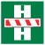 | Portail autoroute |                         |
| **Autres**             |                          | Autres            |                         |

## Dangers

### Dangers

Sources de danger

| Type           | Symbole                                                                | Description                            | Exemple                                                                      |
| -------------- | ---------------------------------------------------------------------- | -------------------------------------- | ---------------------------------------------------------------------------- |
| **Feu**        | 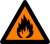               | Danger particulier d’incendie          | Station-service, scierie                                                     |
| **Gaz**        | 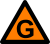               | Gaz inflammable, risque d’explosion    | Citerne de gaz                                                               |
| **Electrique** | 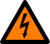 | Source de danger d’origine électrique  | Station transformatrice, panneaux solaires photovoltaïques                   |
| **Toxique**    | 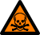       | Produits toxiques                      | Stock de produits                                                            |
| **Radioactif** | 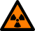 | Sources radioactives                   | Laboratoire                                                                  |
| **Infectieux** | 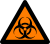 | Substances infectieuses                | Laboratoire                                                                  |
| **Pollution**  | 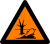   | Produits pouvant causer des pollutions | Stock de produits                                                            |
| **Autre**      |            | Autres sources de danger               | Installation d'enfumage en cas d'effraction, appareil IRM, animaux dangereux |

### Risques

Eléments à risque

| Type                   | Symbole                                                                  | Description                                                                  | Exemple                    |
| ---------------------- | ------------------------------------------------------------------------ | ---------------------------------------------------------------------------- | -------------------------- |
| **EMS**                |                          | Maison de retraite                                                           |                            |
| **Hôpital**            |                          | Hôpital, clinique, centre de convalescence, foyer d’handicapés               |                            |
| **Ecole**              |                          | Ecole, garderie                                                              |                            |
| **Parking souterrain** |                          | Parking souterrain collectif                                                 |                            |
| **Bien culturel**      |                          | Biens mobiliers ou immobiliers à préserver en priorité                       | Archives communales, musée |
| **Pisciculture**       |                          | Site présentant un risque accru en cas de pollution de rivière               |                            |
| **Bâtiment élevé**     |                          | Bâtiment supérieur ou égal à 25 m                                            |                            |
| **Bâtiment isolé**     | 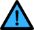 | Bâtiment ne disposant pas d’alimentation en eau suffisante en cas d’incendie | Hameau, ferme isolée       |
| **Autre**              |                          | Autre risque                                                                 |                            |

### Zones de danger

Zones de danger

| Type                         | Symbole                                                          | Description                                                                  | Exemple                    |
| -----------------------------| ---------------------------------------------------------------- | ---------------------------------------------------------------------------- | -------------------------- |
| **Zones de danger ligne HT** | 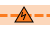                         | Ligne à Haute Tension                                                        |                            |

## Moyens

### Bornes hydrantes

Bornes hydrantes

| Type             | Symbole                                                                                    | Description                 | Exemple |
| ---------------- | ------------------------------------------------------------------------------------------ | --------------------------  | ------- |
| **Hors-sol**     |                            | Borne hydrante              |         |
| **Souterraine**  |    | Borne hydrante souterraine  |         |
| **Hors service** |  | Borne hydrante hors service |         |

### Prises d'arrosage SANE

Prises d'arrosage SANE

| Type                       | Symbole                                      | Description                                                     | Exemple |
| -------------------------- | -------------------------------------------- | --------------------------------------------------------------- | ------- |
| **Prises d'arrosage SANE** |  | Prise d'arrosage SANE (Syndicat d'Arrosage de Nyon et Environs) |         |

### Réserves d'eau

Réserves d'eau

| Type                   | Symbole                                                                                            | Description                                                  | Exemple |
| ---------------------- | -------------------------------------------------------------------------------------------------- | ------------------------------------------------------------ | ------- |
| **Citerne**            |                        | Citerne                                                      |         |
| **Citerne mobile**     |          | Citerne mobile                                               |         |
| **Etang, gouille**     |            | Etang, gouille                                               |         |
| **Puit**               |                              | Puit avec réserve d’eau en cas d’incendie                    |         |
| **Réservoir**          |                    | Réservoir                                                    |         |
| **Commande réservoir** |  | Interrupteur de commande à distance pour la réserve incendie |         |

### Transport d'eau

Transport d'eau

| Type      | Symbole                            | Description     | Exemple                                  |
| --------- | ---------------------------------- | --------------- | ---------------------------------------- |
| **Tuyau** |  | Transport d'eau | Depuis motopompe, entre véhicules relais |

### Barrages

Barrages anti pollution

| Type        | Symbole                                | Description            | Exemple              |
| ----------- | -------------------------------------- | ---------------------- | -------------------- |
| **Barrage** |  | Barrage anti pollution | Sur rivière, sur lac |

## Bâtiments

### Bâtiments

Bâtiments avec objet SDIS (*vue*)

| Type         | Symbole                                  | Description              | Exemple                                                                                            |
| ------------ | ---------------------------------------- | ------------------------ | -------------------------------------------------------------------------------------------------- |
| **Bâtiment** |  | Bâtiment avec objet SDIS | Bâtiment accessible avec clé, bâtiment avec source de danger, bâtiment avec dossier d'intervention |

## Organisation

### Personnel d'intervention

Personnel d'intervention (*vue*)

| Type                | Symbole                                                                          | Description            | Exemple |
| ------------------- | -------------------------------------------------------------------------------- |----------------------- | ------- |
| **Jour**            |            | Groupe Jour            |         |
| **Nuit**            |            | Groupe Nuit            |         |
| **Jour et nuit**    |  | Groupe Jour et nuit    |         |
| **CI-DIR**          |                          | Groupe CI-DIR          |         |

### Secteurs d'intervention

Secteurs d'intervention

| Type                 | Symbole                                                                  | Description                  | Exemple |
| ---------------------| ------------------------------------------------------------------------ | ---------------------------- | ------- |
| **Feu primaire**     |          | Feu primaire                 |         |
| **Feu secondaire**   |      | Feu secondaire               |         |
| **Feu renfort**      |            | Feu renfort                  |         |
| **Désincarcération** |  | Désincarcération (pionnier)  |         |
| **DCH**              |                            | Défense contre hydrocarbures |         |

### Sites

Casernes et locaux

| Type      | Symbole                                            | Description                     | Exemple |
| --------- | -------------------------------------------------- | ------------------------------- | ------- |
| **DPS**   |            | Détachement de premiers secours |         |
| **DAP**   |            | Détachement d'appui             |         |
| **Local** |        | Local                           |         |

### Secteurs organisationnels

Secteurs organisationnels

| Type             | Symbole                                          | Description          | Exemple |
| ---------------- | ------------------------------------------------ | -------------------- | ------- |
| **Nyon-Dôle**    |        | Secteur Nyon-Dôle    |         |
| **Gland-Serine** |  | Secteur Gland-Serine |         |
| **Terre Sainte** |  | Secteur Terre Sainte |         |
